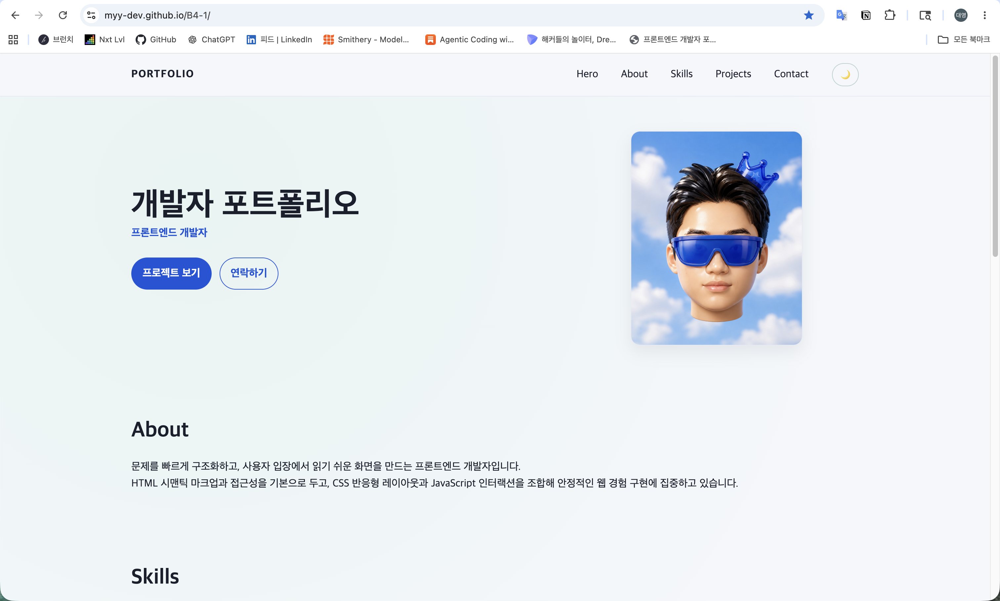
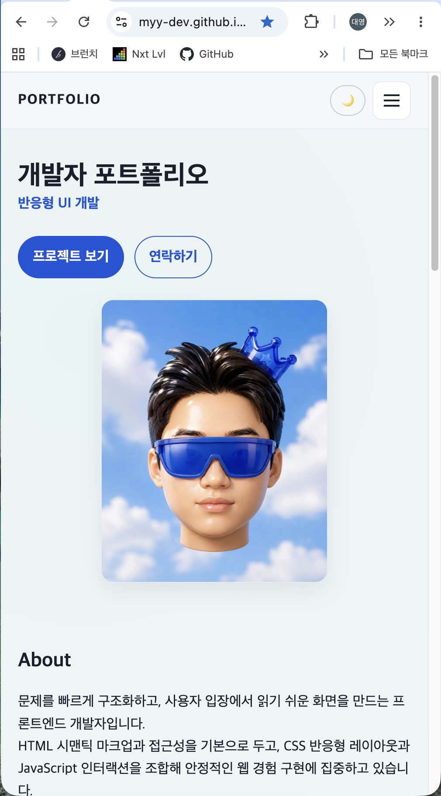
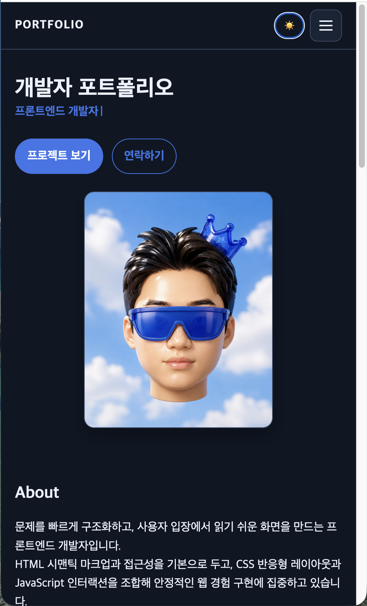

# 웹 기초 완성, 나만의 포트폴리오 구축

## 프로젝트 개요 (Project Overview)

- 순수 HTML/CSS/JavaScript만으로 구축하는 반응형 포트폴리오 웹사이트입니다.

## 실행 환경 (Environment)

- **언어**: HTML5, CSS3, ES6+ JavaScript
- **런타임**: Node.js (25.9.0)

## 프로젝트 구조 (Project Structure)

```text
.
├── index.html       # 메인 페이지
├── css/             # 스타일시트 디렉토리
│   └── style.css    # 외부 스타일시트
├── js/              # JavaScript 디렉토리
└── images/          # 이미지 디렉토리
```

## 수행 항목 체크리스트

### HTML 구조 (시맨틱 마크업)

- [x] 시맨틱 태그 사용 권장
- [x] Hero, About, Skills, Projects, Contact, Footer 섹션 구성
- [x] 네비게이션 내 각 섹션 이동 앵커 링크 구현
- [x] 모든 이미지 의미 있는 `alt` 속성 부여
- [x] 폼 요소에 `<label>` 연결 (`for`-`id` 매칭)

### CSS 스타일링 (레이아웃 & 반응형)

- [x] 외부 스타일시트(`css/style.css`) 연동
- [x] CSS 변수(`:root`) 활용 (색상, 폰트, 간격 등)
- [x] 다크 모드용 CSS 변수 분리 정의 (`[data-theme="dark"]`)
- [x] 네비게이션에 `Flexbox`, Projects 카드에 `Grid`(`auto-fit`, `minmax`) 활용
- [x] 모바일 퍼스트 반응형 디자인 설계 (브레이크포인트: 768px, 1024px)
- [x] 모바일 환경 햄버거 메뉴 디자인 구성
- [x] 버튼 및 카드 요소 `hover`(`transition`) 효과 적용
- [x] 카드 `box-shadow` 효과 적용

### JavaScript 기초 및 인터랙션

- [x] JS 파일 `defer` 속성 연동
- [x] `var` 사용 금지 (`const`, `let` 사용)
- [x] 인라인 `onclick` 대신 `addEventListener` 이벤트 처리
- [x] 모바일 햄버거 메뉴 토글 구현
- [x] 네비게이션 클릭 시 부드러운 스크롤(`smooth scroll`) 구현
- [x] 스크롤 300px 이상 탑 버튼 구현
- [x] 스크롤 60px 이상 네비게이션 배경색 변경
- [x] 다크 모드 전환 및 설정 값 로컬스토리지(`localStorage`) 유지
- [x] Intersection Observer 활용 스크롤 애니메이션(임계값 0.2 이상) 구현

### 폼 UX 개선

- [x] Contact 문의 폼 제출 이벤트 제어 (`event.preventDefault()`)
- [x] 필수값(이름, 이메일, 메시지) 유효성 검사 (빈 필드 제출 불가)
- [x] 이메일 형식 유효성 검사
- [x] 입력 필드 근처 에러 메시지 표시
- [x] 유효성 검사 통과 시 제출 성공 메시지 표시

### API 연동 및 상태 관리

- [x] ES6+ 문법 적용(화살표 함수, 구조분해 할당, 템플릿 리터럴, 배열 메서드)
- [x] `fetch`, `async/await` 활용 GitHub API 호출(`https://api.github.com/users/myy-dev/repos`)
- [x] `try/catch` 비동기 에러 처리 (API 레이트 리밋 403 에러 포함)
- [x] 데이터 상태별 UI 분기 렌더링:
  - [x] 로딩 상태 (스피너 또는 "로딩 중...")
  - [x] 성공 상태 (카드 리스트 렌더링)
  - [x] 에러 상태 ("프로젝트를 불러올 수 없습니다" + [재시도] 버튼)
  - [x] 빈 상태 ("표시할 프로젝트가 없습니다")
- [x] "사용자 이벤트 → 상태 변경 → 화면 업데이트" 기능 3가지 이상 구현

### 배포

- [x] GitHub Pages 배포
- [x] 배포 URL 내 기능 정상 동작 확인(인터랙션, API 연동, 폼 검사 등)
- [x] README.md 작성 (프로젝트 설명, 사용 기술, 배포 URL, 스크린샷)

### 보너스 과제

- [x] **프로젝트 필터링**: 언어별 필터링 버튼 구현 (`array.filter()` 활용)
- [x] **타이핑 효과**: Hero 섹션 타이핑 애니메이션 구현
- [x] **폼 실제 전송**: Formspree 또는 EmailJS 연동 실제 이메일 전송 구현
- [x] **시스템 다크 모드 감지**: `prefers-color-scheme` 활용 시스템 테마 감지 및 반영

### 제약 사항 (Constraints)

- **외부 라이브러리 사용 금지**: React, Vue, jQuery, Bootstrap, Tailwind CSS 등 사용 불가
- **허용 항목**: 아이콘(Font Awesome), 웹 폰트(Google Fonts)만 허용
- **코드 스타일**:
  - `var` 대신 `const`, `let` 사용
  - HTML에 `onclick` 대신 `addEventListener` 사용
  - 인라인 스타일(`style="..."`) 사용 금지
- **브라우저**: 최신 Chrome 브라우저에서 정상 동작
- **GitHub API 주의**: 인증 없이 호출 시 시간당 60회 제한(레이트 리밋)이 있으므로, 짧은 시간 내 반복 새로고침을 피한다

### 커스텀 설정값 명세

| 항목                         | 기준값     | 비고           |
| ---------------------------- | ---------- | -------------- |
| 스크롤 탑 버튼 표시          | 300px 이상 | 자유 변경 가능 |
| 네비게이션 배경색 변경       | 60px 이상  | 자유 변경 가능 |
| Intersection Observer 임계값 | 0.2 이상   | 자유 변경 가능 |

## 결과물 (Deliverables)

- 배포 URL: [GitHub Pages](https://myy-dev.github.io/B4-1/)
- 스크린샷:

| 데스크톱                                        | 모바일                                       | 다크 모드                                     |
| ----------------------------------------------- | -------------------------------------------- | --------------------------------------------- |
|  |  |  |
